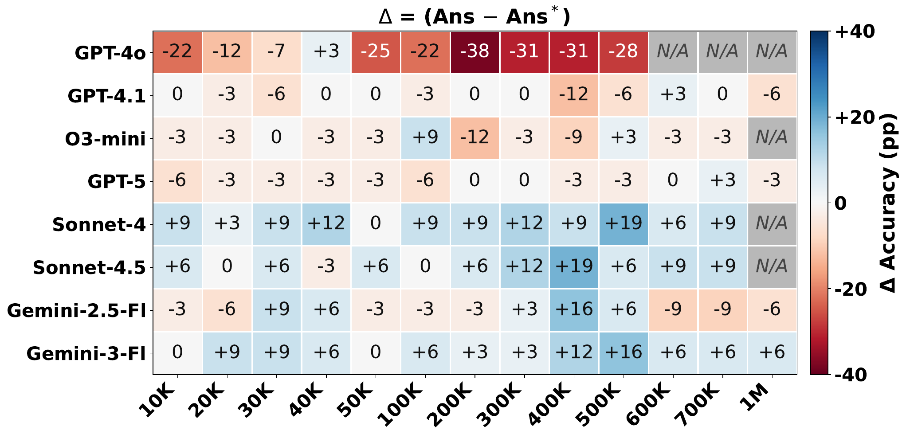

<h1 align="center">Evidence-Based Generation (EBG) for Long-Context QA</h1>

<p align="center"><em><a href="assets/LC-EBG.pdf">The Bottleneck Is Retrieval, Not Reading: Diagnosing Evidence-Based Generation with RAG for Long-Context Question Answering</a></em></p>

<p align="center">
  <!-- <a href="long_context/NoLiMa-based"><b>NoLiMa-based LC</b></a>&nbsp;|&nbsp;
  <a href="long_context/Synthetic-based"><b>Synthetic LC</b></a>&nbsp;|&nbsp;
  <a href="NoLiMa_based_RAG"><b>NoLiMa-based RAG</b></a>&nbsp;|&nbsp;
  <a href="multidocument_qa"><b>Multi-document QA</b></a>&nbsp;|&nbsp; -->
  <a href="datasets"><b>Datasets</b></a>&nbsp;|&nbsp;
  <a href="#key-results"><b>Key results</b></a>&nbsp;|&nbsp;
  <a href="#quick-start"><b>Quick start</b></a>
</p>

This repository contains the data and code for **Evidence-Based Generation (EBG)** — a framework that requires language models to return both an **answer** and **line-level citations** to the supporting evidence, scored with a joint **Ans+Evid** metric. EBG treats long-context (LC) models as a controlled probe for diagnosing *where* a question-answering pipeline breaks: in **retrieval**, in **grounding**, or in **reading**.

Standard QA evaluation reports answer correctness alone, which conflates two very different failure modes — the retriever failing to surface the right passages versus the reader failing to use them. By asking the model to cite the input lines it relied on, EBG separates the two and exposes grounding failures that answer-only evaluation cannot see.

> **Note:** This README is the high-level entry point and presents two research questions - RQ1 and RQ2. Please follow the table of contents to navigate different experiments and datasets.


## Table of Contents

- [The EBG task](#the-ebg-task)
- [Benchmarks](#benchmarks)
- [Key results](#key-results)
  - [RQ1 — What are the practical limitations of RAG, and can long-context EBG address them?](#rq1--what-are-the-practical-limitations-of-rag-and-can-long-context-ebg-address-them)
  - [RQ2 — Does requiring evidence citations improve answer accuracy?](#rq2--does-requiring-evidence-citations-improve-answer-accuracy)
  - [Beyond RQ1 and RQ2](#beyond-rq1-and-rq2)
- [Repository structure](#repository-structure)
- [Quick start](#quick-start)
- [Citation](#citation)
- [License](#license)

## The EBG task

Instead of returning only an answer, the model is prompted to return an answer **and** the input line numbers that support it, in JSON:

```json
{ "lines": [56, 67], "answer": "FitBand" }
```

The exact prompt pairs a short system instruction with the line-numbered context:

```text
[system]
Your job is to answer the question entirely from the context and provide a
reference. Your answer should cite all lines the answer is based on.

[user]
<context>{haystack}</context>

Answer the question based on information only from the context. If the question
is not answerable from the context, answer NA. Your response should comprise
only the answer and all lines the answer is based on in json format.
For example:

{ "lines": [25, 412], "answer": "John" }

Question: Which character cannot eat Brandade?
```

Each response is scored with three complementary metrics:

| Metric | Definition |
|--------|------------|
| **Ans** | Answer correctness (standard answer-only accuracy). |
| **Evid** | Evidence correctness — the cited lines contain the gold supporting evidence. |
| **Ans+Evid** | Joint accuracy: the answer is correct **and** the evidence is correctly cited. The strictest, most diagnostic measure. |

We evaluate ten frontier LLMs from three providers (GPT-4o, GPT-4.1, o3-mini, GPT-5, GPT-5.5, Sonnet-4, Sonnet-4.5, Opus-4.6, Gemini-2.5-Flash, Gemini-3-Flash) under matched long-context and RAG pipelines across contexts spanning **10K characters to several million** — up to ~1M on the NoLiMa-based benchmark and up to ~5M on the synthetic two-hop task.

## Benchmarks

EBG spans four datasets, evaluated under matched **long-context (LC)** and **retrieval-augmented (RAG)** pipelines. Two datasets stress long-context *reading* and two stress the *retrieval* pipeline; the NoLiMa haystacks are run both as a long-context benchmark and as a dedicated RAG study, so the same evidence can be probed under both pipelines.

| Benchmark | Data & setting | What it probes | Code |
|-----------|----------------|----------------|------|
| **NoLiMa-based LC** | Evidence-augmented NoLiMa haystacks, 10K–1M chars | Long-context reading & grounding without lexical shortcuts | [`long_context/NoLiMa-based/`](long_context/NoLiMa-based) |
| **NoLiMa-based RAG** | Same NoLiMa haystacks, top-K chunks retrieved from a Qdrant store | Whether similarity retrieval surfaces the needle that LC reads directly | [`NoLiMa_based_RAG/`](NoLiMa_based_RAG) |
| **Synthetic LC** | Controlled distractor haystack with curated two-hop needles, up to ~5M chars | Controlled, ceiling-level two-hop reading | [`long_context/Synthetic-based/`](long_context/Synthetic-based) |
| **MultiHop-RAG** | Realistic web-news multi-document QA, re-instrumented with line-level evidence | Multi-fact retrieval across documents (LC vs. RAG) | [`multidocument_qa/`](multidocument_qa) |
| **QASPER-MP** | Multi-paper QASPER adaptation with realistic short paper cues | Document-identity retrieval (LC vs. RAG) | [`multidocument_qa/`](multidocument_qa) |

## Key results

### RQ1 — What are the practical limitations of RAG, and can long-context EBG address them?

**Retrieval is the dominant failure point.** Similarity-based RAG reliably surfaces *any* relevant chunk but rarely *all* the chunks a multi-fact query needs (Hits@10 of 82% vs. 19% on MultiHop-RAG), and chunking destroys the document metadata that identity-bearing queries depend on. Feeding the model the **full long context** instead removes the retriever from the loop — and head to head, long-context EBG answers far better than RAG at every retrieval budget.

**LC-EBG vs. RAG-EBG, head to head (MultiHop-RAG, 50 pilot queries).** Long-context reading wins decisively on answer accuracy — full-context **LC is the best *Ans* for every model, beating even RAG@200**. But the strict joint *Ans+Evid* metric collapses under *both* pipelines (single digits to low-30s), and long-context reading's own evidence citation can be weak (Sonnet-4.5 cites the correct evidence only 10% of the time under LC) — a grounding gap that answer-only scoring hides entirely.

*Answer-only prompt (Ans ≡ Joint):*

| Model | LC (full) | RAG@4 | RAG@10 | RAG@25 | RAG@50 | RAG@100 | RAG@200 |
|-------|:---------:|:-----:|:------:|:------:|:------:|:-------:|:-------:|
| GPT-5 | **82.0** | 58.0 | 60.0 | 70.0 | 72.0 | 74.0 | 78.0 |
| Sonnet-4.5 | **68.0** | 24.0 | 36.0 | 38.0 | 56.0 | 58.0 | 68.0 |
| Gemini-3-Flash | **80.0** | 38.0 | 44.0 | 50.0 | 58.0 | 58.0 | 70.0 |

*EBG prompt (Ans / Evid / Joint):*

| Model | Metric | LC (full) | RAG@4 | RAG@10 | RAG@25 | RAG@50 | RAG@100 | RAG@200 |
|-------|--------|:---------:|:-----:|:------:|:------:|:------:|:-------:|:-------:|
| **GPT-5** | Ans | **86.0** | 58.0 | 60.0 | 64.0 | 72.0 | 76.0 | 76.0 |
| | Evid | 36.0 | 38.0 | 36.0 | 30.0 | 30.0 | 30.0 | 30.0 |
| | Joint | 28.0 | **34.0** | 26.0 | 22.0 | 20.0 | 22.0 | 22.0 |
| **Sonnet-4.5** | Ans | **82.0** | 42.0 | 48.0 | 62.0 | 70.0 | 68.0 | 74.0 |
| | Evid | 10.0 | 30.0 | 30.0 | 22.0 | 16.0 | 18.0 | 14.0 |
| | Joint | 8.0 | **26.0** | 22.0 | 18.0 | 16.0 | 12.0 | 12.0 |
| **Gemini-3-Flash** | Ans | **78.0** | 38.0 | 44.0 | 46.0 | 64.0 | 62.0 | 66.0 |
| | Evid | 40.0 | 28.0 | 18.0 | 24.0 | 24.0 | 24.0 | 28.0 |
| | Joint | **28.0** | 26.0 | 14.0 | 18.0 | 20.0 | 18.0 | 20.0 |

<sub>Percentages over n = 50 (Sonnet-4.5 RAG@200 under EBG: n = 49). **Bold** marks the best value in each *Ans* and *Joint* row; higher is better.</sub>

### RQ2 — Does requiring evidence citations improve answer accuracy?

Requiring the model to cite its evidence acts as a **reasoning scaffold**: for several models it raises answer accuracy, especially at long contexts. The heatmap below shows the per-cell difference Δ = (Ans − Ans\*) between EBG prompting (Ans) and answer-only prompting (Ans\*) on the NoLiMa-based benchmark; **positive (blue) means citation prompting helps**.



- **Claude Sonnet (4 and 4.5) and the Gemini models gain up to +19 pp** from EBG prompting, with the largest gains concentrated at long contexts (≈300K–900K characters).
- For the strongest models (GPT-5, GPT-4.1) the effect is **within noise** — they already sit near ceiling under both prompts. The effect reverses for GPT-4o (the red row), which loses accuracy under the stricter citation format.
- The effect is invisible on the saturated synthetic benchmark (Ans and Ans\* are within sampling noise) and surfaces only at scale on NoLiMa.
- The scaffold effect **replicates on realistic, non-synthetic data**: on MultiHop-RAG, EBG prompting raises Sonnet-4.5's answer accuracy by **+14 pp** (68% → 82%).


### Beyond RQ1 and RQ2

Beyond the two questions above, EBG also exposes a **grounding failure under knowledge conflict**: when the in-context evidence contradicts a model's parametric knowledge, grounding degrades sharply. The code for this analysis lives in [`long_context/NoLiMa-based/`](long_context/NoLiMa-based/README.md) (contradictory-evidence grounding, via `run_contradictory_two_needle.py`), and the multi-document retrieval analyses behind RQ1 live in [`multidocument_qa/`](multidocument_qa/README.md). Full quantitative results for both are reported in the paper (its RQ1 and RQ4).

## Repository structure

```
EBG_repo/
├── README.md                   # This file — overview, key results, quick start
├── LICENSE                     # Adobe Research License (non-commercial research)
├── .env.example                # API-key template (copy to .env)
├── .gitignore
├── long_context/               # Long-context (LC) EBG experiments
│   ├── NoLiMa-based/            #   NoLiMa-based LC benchmark (runners, plots)    — see sub-README
│   └── Synthetic-based/         #   Synthetic two-hop benchmark (runner)          — see sub-README
├── NoLiMa_based_RAG/            # RAG top-K retrieval & evaluation on NoLiMa       — see sub-README
├── multidocument_qa/            # Multi-document LC-vs-RAG EBG                      — see sub-README
│   ├── experiments.py          #   Shared engine (model registry, prompts, scoring)
│   ├── multihop_rag/           #   MultiHop-RAG pipeline
│   └── qasper_mp/              #   QASPER-MP pipeline
├── datasets/                   # Shared datasets (download/build scripts)
│   ├── NoLiMa/                 #   NoLiMa needle sets & haystack pipeline        — see sub-README
│   ├── Synthetic/              #   Synthetic dataset generation                  — see sub-README
│   ├── MultiHopRAG/            #   MultiHop-RAG dataset download/build           — see sub-README
│   └── QASPER-MP/              #   QASPER-MP dataset download/build              — see sub-README
└── assets/                     # Figures used in this README
```

Detailed setup, data, and reproduction instructions live in each sub-project's README:

- **[`long_context/NoLiMa-based/`](long_context/NoLiMa-based/README.md)** — long-context EBG evaluation on the NoLiMa-based benchmark (answer-only, two-needle, contradictory two-needle), plus plotting scripts.
- **[`long_context/Synthetic-based/`](long_context/Synthetic-based/README.md)** — long-context EBG on the synthetic two-hop needle-in-a-haystack task (10K–5M characters).
- **[`NoLiMa_based_RAG/`](NoLiMa_based_RAG/README.md)** — RAG top-K retrieval-and-evaluation pipeline (Qdrant embedding store, retrieval ranking, LC-vs-RAG comparison).
- **[`multidocument_qa/`](multidocument_qa/README.md)** — LC-vs-RAG EBG on the MultiHop-RAG and QASPER-MP multi-document benchmarks.
- **[`datasets/NoLiMa/`](datasets/NoLiMa/README.md)** — shared NoLiMa needle sets, haystacks, and data-preparation utilities.
- **[`datasets/Synthetic/`](datasets/Synthetic/README.md)**, **[`datasets/MultiHopRAG/`](datasets/MultiHopRAG/README.md)**, **[`datasets/QASPER-MP/`](datasets/QASPER-MP/README.md)** — dataset generation / download instructions for the corresponding benchmarks.

## Quick start

Each sub-project is self-contained, with its own dependencies and detailed instructions. The fastest path to a running experiment is the long-context EBG benchmark:

```bash
# 1. Clone
git clone <repository-url>

# 2. Install the long-context benchmark's dependencies
cd long_context/NoLiMa-based
python -m venv .venv && source .venv/bin/activate
pip install -r requirements.txt

# 3. Provide the API keys for the models you want to run
export OPENAI_API_KEY=...      # only the keys you need
export ANTHROPIC_API_KEY=...
export GOOGLE_API_KEY=...

# 4. Smoke-test the pipeline without spending tokens
python experimentation/run_full_scale.py --list-models
python experimentation/run_full_scale.py --dry-run --model gpt-4o --context-length 10000

# 5. Run one model at one context length
python experimentation/run_full_scale.py --model gpt-4o --context-length 100000
```

Then explore the rest:

1. **Prepare / download the shared dataset** — [`datasets/NoLiMa/`](datasets/NoLiMa/README.md) (`bash datasets/NoLiMa/scripts/download_NoLiMa_data.sh` from the repo root).
2. **Run the long-context EBG benchmark** — [`long_context/NoLiMa-based/`](long_context/NoLiMa-based/README.md) (answer-only, two-needle, and contradictory two-needle experiments, plus plotting).
3. **Run the synthetic two-hop benchmark** — [`long_context/Synthetic-based/`](long_context/Synthetic-based/README.md) (controlled distractor haystacks from 10K up to ~5M characters).
4. **Run the RAG comparison** — [`NoLiMa_based_RAG/`](NoLiMa_based_RAG/README.md) (embed the haystack, retrieve top-K, evaluate LC vs. RAG).
5. **Run the multi-document LC-vs-RAG benchmarks** — [`multidocument_qa/`](multidocument_qa/README.md) (MultiHop-RAG and QASPER-MP, with line- and paragraph-level evidence).

All experiments call frontier LLM APIs and expect provider keys (`OPENAI_API_KEY`, `ANTHROPIC_API_KEY`, `GOOGLE_API_KEY`) — only the keys for the models you run are required.

## Citation

This work is currently under anonymous review. Please cite as:

```bibtex
@misc{anonymous-ebg,
  title        = {The Bottleneck Is Retrieval, Not Reading: Diagnosing Evidence-Based
                  Generation with RAG for Long Context Question Answering},
  author       = {Anonymous},
  year         = {2026},
  note         = {Under review}
}
```
